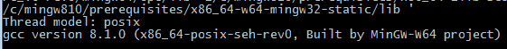
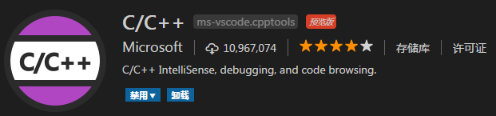
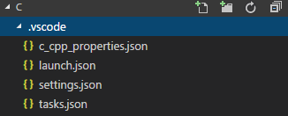
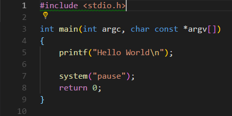
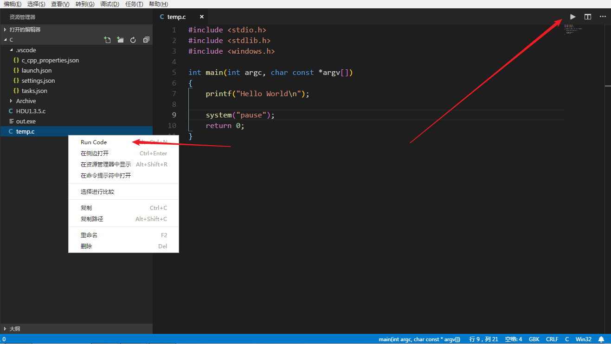

> 平时会写一些 ACM 的算法题目，大多都是一些单文件的程序，加上不是很喜欢 Dev-C++ 略显老套的界面，也不喜欢宇宙级IDE Visual Studio 的庞大（
>
> 在~~无意中~~了解到 VSCode 是由微软开发的、跨平台的、开源的文本编辑器，并且它的功能和扩展都很多，于是就下载调教了一番。

# 环境配置

## [VS Code](https://code.visualstudio.com/)

  VS Code 的下载、安装，我就不多说了 。

## 编译器

  VS Code 只是一个编辑器，并不是 IDE （集成开发环境），不含编译器（和许多其它功能），所以需要我们自己安装编译器。我安装的是 [Mingw-w64](https://mingw-w64.org)  gcc-8.1.0 。

## 环境变量配置

  将安装的 gcc 添加到系统变量 PATH 中（不懂配置的可以自己搜索，配环境变量应该是对程序员而言最轻松的事了）。环境变量配置好之后在 cmd 中输入 `gcc -v` ，显示如下信息表示安装配置成功。
  

# VSCode 中的配置

## 安装插件

  

  打开 VSCode ，按下 `Ctrl+Shift+P` 在扩展页搜索 `C/C++` ，安装。

  安装完成之后**重启VSCode生效**。

## 设置好代码目录

  创建一个你打算存放代码的文件夹，**路径不能含有中文和空格和引号**。c 语言和 c++ 需要建立不同的工作区（除非你懂得下面 json 文件的某些选项，则可以做到一个工作区使用不同的 build task）。

下面**以一个 C 语言文件夹为例**（如果你想配置 C++ ，记得替换相应的参数）：

  用 VSCode 打开这个文件夹，在左侧的“资源管理器”中右键新建 `.VSCode` 文件夹（注意最前面有个点），然后创建 `launch.json`，`tasks.json`，`settings.json`，`c_cpp_properties.json` 放到 .VSCode 文件夹下 。效果图：
  

## c_cpp_properties.json 环境设置

  复制以下内容到 c_cpp_properties.json 中【这个 json 不允许有注释（其实按照标准本来就不能有）】：

  ```json
  {
    "configurations": [
        {
            "name": "Win32",
            "includePath": [
                "${workspaceFolder}"
            ],
            "defines": [
                "_DEBUG",
                "UNICODE"
            ],
            "compilerPath": "C:\\Program Files\\mingw64\\bin\\gcc.exe",
            "browse": {
                "path": [
                    "${workspaceFolder}"
                ],
                "limitSymbolsToIncludedHeaders": true,
                "databaseFilename": ""
            }
        }
    ],
    "version": 4
  }
  ```

  `"compilerPath"` 里填写你自己的 gcc.exe 文件目录。

## tasks.json 编译

复制以下内容到 tasks.json 中：

```json
{
  "version": "2.0.0",
  "tasks": [
      {          
          "label": "gcc",
          "type": "shell",
          "command": "gcc",
          "args": [
              "-Wall","-std=c99","-g","${file}","-o","out"
          ],
          "group": {
                "kind": "build",
                "isDefault": true
          }
      }
  ]
}
```

> "label"：任务名称，之后可以添加到 launch.json 的 preLaunchTask
>
> "type"：可以为 shel l或 process，前者相当于先打开shell再输入命令，后者是直接运行命令
>
> "command"：要使用的编译器
>
> "args": []：编译命令参数，根据自己情况修改
>
> "isDefault"：是否设为默认

## launch.json 调试

复制以下内容到 launch.json 中：

```json
{
  "version": "0.2.0",
  "configurations": [
      {
          "name": "(gdb) Debug",
          "type": "cppdbg",
          "request": "launch",
          "program": "${workspaceFolder}/out.exe",
          "args": [],
          "stopAtEntry": false,
          "cwd": "${workspaceFolder}",
          "environment": [],
          "externalConsole": true,
          "MIMode": "gdb",
          "miDebuggerPath": "C:\\Program Files\\mingw64\\bin\\gdb.exe",
          "setupCommands": [
              {
                  "description": "Enable pretty-printing for gdb",
                  "text": "-enable-pretty-printing",
                  "ignoreFailures": true
              }
          ],
          "preLaunchTask": "gcc"
      }
  ]
}
```

> "name"：配置名称，将会在启动配置的下拉菜单中显示
>
> "type"：配置类型，这里只能为cppdbg
>
> "request"：请求配置类型，可以为launch（启动）或attach（附加）
>
> "program"：将要进行调试的程序的路径
>
> "args"：程序调试时传递给程序的命令行参数，一般设为空即可
>
> "stopAtEntry"：设为true时程序将暂停在程序入口处
>
> "cwd"：调试程序时的工作目录
>
> "environment"：（环境变量？）
>
> "externalConsole"：调试时是否显示控制台窗口，一般设置为true显示控制台
>
> "MIMode"：指定连接的调试器，可以为gdb或lldb
>
> 在 `"miDebuggerPath"` 里填写你自己的 gdb.exe 的目录，就是 Mingw-w64 目录下的。**注意路径中的 `\` 需要用 `\\` 表示**
>
> "setupCommands"：用处未知，模板如此
>
> `"preLaunchTask": "gcc"` 加了这句之后，就可以在调试之前自动执行一遍编译工作了

## settings.json 独立的工作区设置

在'工作区设置'里填写的的设置是**只对当前目录下生效**的，把这个文件里的东西放到“用户设置”里也可以覆盖全局设置，自己进行选择。

一般我是没有什么要往这里写的，可能会填一个 `"files.defaultLanguage": "c", // ctrl+N 新建文件后默认的语言`。

# 实战一下

## 补全 "includepath"

  这个时候我们新建一个 HelloWorld 来试试效果。不出意外，你应该会见到下图的样子：

  

  在 `#include <stdio.h>` 一行出现一个黄色小灯泡，我们点击这个灯泡，点击 `add to "includepath"` 选项，完成 `c_cpp_properties.json` 中的 `"includePath"` 一项的填写。
  或者，你可以参考我的路径自行填写：

> "${workspaceFolder}",
>
> // 以下需要一个 INCLUDE_PATH_HOME 系统变量
>
> "${env.INCLUDE_PATH_HOME}/include/c++",
>
> "${env.INCLUDE_PATH_HOME}/include/c++/x86_64-w64-mingw32",
>
> "${env.INCLUDE_PATH_HOME}/include/c++/backward",
>
> "${env.INCLUDE_PATH_HOME}/include",
>
> "${env.INCLUDE_PATH_HOME}/include-fixed"

## 编译

  按下 `Ctrl+Shift+B` ，在弹出的窗口中选择要运行的生成任务（gcc），选择 “继续而不扫描任务输出” ，如果没有错误，在 “终端” 处会提示 “终端将被任务重用，按任意键关闭。” ，这样子就完成了编译的工作。
  
## 调试

  建好断点，按下 `F5` 。 VSCode 的调试还是很棒的，变量、监视、调用堆栈、断点一目了然。

# 另一个插件 Code Runner

> 上面说的方法呢 编译之后还需要手动去执行 out.exe ，而且只适用于存放在工作文件夹下的代码；有些情况呢，我们可能需要去处理其他目录的单个代码文件 或者 我们希望编译运行的过程再简单点。
>

  在“扩展”页搜索 `Code Runner` ，安装插件并启用。

  在 “资源管理器” 页右击 HelloWorld.c，会发现多了一个 `Run Code` 的选项，点击即可编译+运行程序，不过先不要急，我们先设置一下这个插件。

  选择 “文件 -> 首选项 -> 设置” ，往下找到 “Run Code configuration” ，展开就是 Code Runner 的众多设置项了。

  我主要是设置了以下几个选项：

```json
    "code-runner.runInTerminal": true,
    "code-runner.saveFileBeforeRun": true,
    "code-runner.executorMap": {
        "c": "cd /d $dir && gcc -Wall -std=c99 -g $fileName -o $fileNameWithoutExt && $fileNameWithoutExt",
        "cpp": "cd /d $dir && g++ -Wall -std=c++11 -g $fileName -o $fileNameWithoutExt && $fileNameWithoutExt",
    },
    "code-runner.clearPreviousOutput": true,
```

  至于是添加到 用户设置 还是 工作区设置，看你喜欢咯（

  现在你就可以右键源文件，选择 `Run Code` 了；除了这里还有在打开的源代码的屏幕右上角也有一个 `Run Code` 选项，两者效果一样。



> 另，Code Runner 其实还支持运行选中的部分代码，不过在 C/C++ 一般是用不到的。

# 一些我在用的其它插件

- **Settings Sync**  同步你的设置项

- **Bracket Pair Colorizer**  对括号进行配对着色

- **VSCode Great Icons**  一个我感觉蛮不错的 icon 插件

- **One Dark Pro**  一款暗色系主题