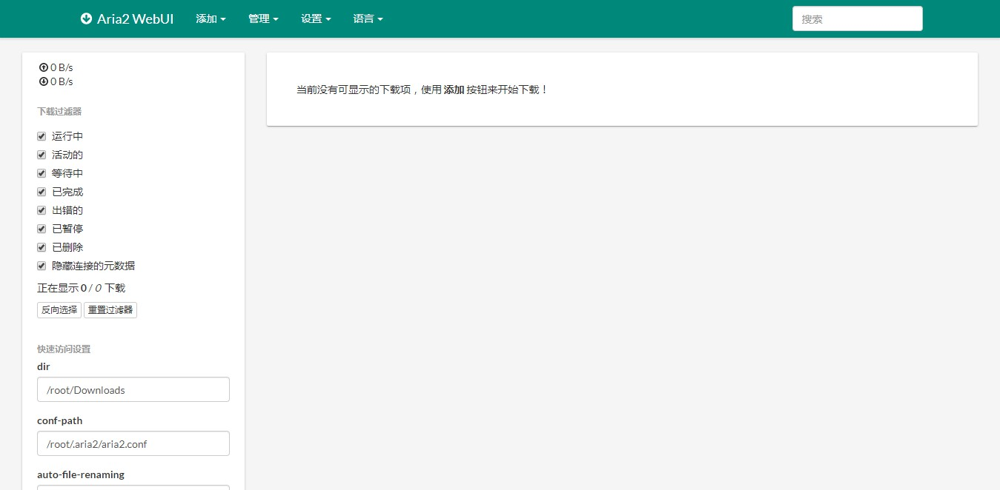
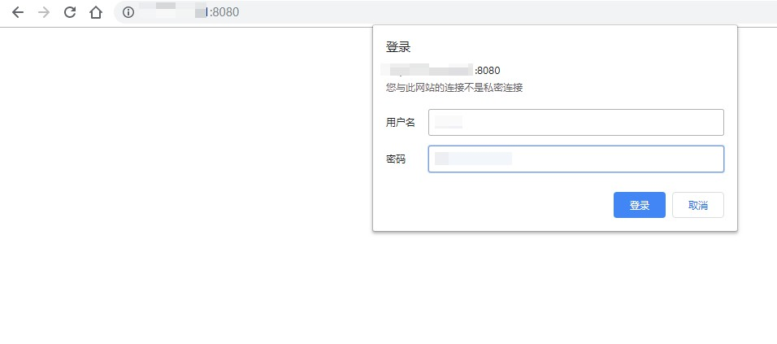

> 最近阿里云一波学生机优惠，就趁机入了一年；买来之后，试着搭建了 [L4D2](https://store.steampowered.com/app/550/Left_4_Dead_2/) 游戏服务器和 [无污染 DNS](https://kirikira.moe/post/23/) 。

> 但是觉得还没有折腾够 VPS，于是就 Google 了下『Aria2 + Nginx 搭建离线下载』，遂有了记录布置过程到这篇博文的想法。

2019-11-26 更新：如果你对 docker 有所了解的话，可以使用我的 repo [[docker-aria2-with-webui]](https://github.com/test482/docker-aria2-with-webui) 来快速部署。

# 安装并配置 Aria2

> 以 阿里云 Ubuntu 16.04.6 LTS 为例

- 照例先滚一滚系统：
  `apt update && apt upgrade -y`

- 安装 [Aria2](https://zh.wikipedia.org/wiki/Aria2)：
  `apt install aria2`

aria2 最简单的运行方式是 `aria2c <download-url-path>`，即会从给出的 url 下载文件。这里需要 aria2 后台驻留并使用 WebUI 调用 aria2 。

aria2 启动时会首先尝试从 `$HOME/.aria2/aria2.conf` 读取配置文件，此处我使用的是 root 用户，那么目录即为 `/root/.aria2/aria2.conf` 。

## Aria2 配置文件

- 创建配置文件

```bash
cd ~
mkdir .aria2
cd .aria2/
touch aria2.conf aria2.session
```

- `nano aria2.conf` 写入以下配置内容

```text
#参考自 http://www.senra.me/aria2-conf-file-parameters-translation-and-explanation/comment-page-1/

################################################################################
### 请自行替换配置内容。使用绝对路径,例如 /root/.aria2/aria2.conf !###
################################################################################

# 外部访问安全令牌，用于身份验证
rpc-secret=YOUR_SECRET_KEY

#下载路径
dir=/root/Downloads

#配置文件路径
conf-path=/root/.aria2/aria2.conf

#状态保存文件
#当退出时保存错误及未完成的任务到指定的文件中. 您可以在重启 aria2 时使用 --input-file 选项重新加载. 如果您希望输出的内容使用 GZip 压缩, 您可以在文件名后增加 .gz 扩展名. 请注意, 通过 aria2.addTorrent() 和 aria2.addMetalink() RPC 方法添加的下载, 其元数据没有保存到文件的将不会保存. 通过 aria2.remove() 和 aria2.forceRemove() 删除的下载将不会保存.
save-session=/root/.aria2/aria2.session

#指定开启时读取会话文件的位置
input-file=/root/.aria2/aria2.session

#禁用 IPv6
disable-ipv6=false

#最大同时下载数
max-concurrent-downloads=5

#单服务器最大连接数
max-connection-per-server=5

#最小文件分片大小
#aria2 不会分割小于 2*SIZE 字节的文件. 例如, 文件大小为 20MB, 如果 SIZE 为 10M, aria2 会把文件分成 2 段 [0-10MB) 和 [10MB-20MB), 并且使用 2 个源进行下载 (如果 --split >= 2). 如果 SIZE 为 15M, 由于 2*15M > 20MB, 因此 aria2 不会分割文件并使用 1 个源进行下载. 您可以增加数值的单位 K 或 M (1K = 1024, 1M = 1024K). 可以设置的值为: 1M-1024M.
min-split-size=20M

#最小分享率
#指定分享率. 当分享率达到此选项设置的值时会完成做种. 强烈建议您将此选项设置为大于等于 1.0. 如果您想不限制分享比率, 可以设置为 0.0. 如果同时设置了 --seed-time 选项, 当任意一个条件满足时将停止做种.
seed-ratio=1.0

#启用 JSON-RPC/XML-RPC 服务器
enable-rpc=true

#接受所有远程请求
#在 RPC 响应头增加 Access-Control-Allow-Origin 字段, 值为 * .
rpc-allow-origin-all=true

#在所有网卡上监听
#在所有网络适配器上监听 JSON-RPC/XML-RPC 的请求, 如果设置为"否", 仅监听本地网络的请求.
rpc-listen-all=true

#监听端口
rpc-listen-port=6800

#启用后台进程
daemon=true

#磁盘缓存
#启用磁盘缓存. 如果设置为 0, 将禁用磁盘缓存. 此功能将下载的数据缓存在内存中, 最多占用此选项设置的字节数. 缓存存储由 aria2 实例创建并对所有下载共享. 由于数据以较大的单位写入并按文件的偏移重新排序, 所以磁盘缓存的一个优点是减少磁盘的 I/O. 如果调用哈希检查时并且数据缓存在内存中时, 将不需要从磁盘中读取. 大小可以包含 K 或 M (1K = 1024, 1M = 1024K).
disk-cache=16M

#文件分配方法
#指定文件分配方法. "无" 不会预先分配文件空间. "prealloc"会在下载开始前预先分配空间. 这将会根据文件的大小需要一定的时间. 如果您使用的是较新的文件系统, 例如 ext4 (带扩展支持), btrfs, xfs 或 NTFS (仅 MinGW 构建), "falloc" 是最好的选择. 其几乎可以瞬间分配大(数 GiB)文件. 不要在旧的文件系统, 例如 ext3 和 FAT32 上使用 falloc, 因为与 prealloc 花费的时间相同, 并且其会阻塞 aria2 知道分配完成. 当您的系统不支持 posix_fallocate(3) 函数时, falloc 可能无法使用. "trunc" 使用 ftruncate(2) 系统调用或平台特定的实现将文件截取到特定的长度. 在多文件的 BitTorrent 下载中, 若某文件与其相邻的文件共享相同的分片时, 则相邻的文件也会被分配.
file-allocation=falloc

#保存状态间隔
#每隔此选项设置的时间(秒)后会保存错误或未完成的任务到 --save-session 选项指定的文件中. 如果设置为 0, 仅当 aria2 退出时才会保存.
save-session-interval=300
```

> 『下载路径』必须是一个存在的目录，aria2 不会去创建这个目录。

aria2 还有一些其他设置项，这里不说了，有兴趣可以看[官方说明文档](https://aria2.github.io/manual/en/html/aria2c.html#aria2-conf)。

在写好配置文件后，若设置了 `daemon=true` ，那么直接运行 `aria2c` 也可在后台运行。

## 使用 systemd 管理

万物皆可底裤，`nano /etc/systemd/system/aria2.service` 写入以下内容：

```text
[Unit]
Description=Aria2
After=syslog.target
After=network.target

[Service]
Type=forking
ExecStart=/usr/bin/aria2c
Restart=always

[Install]
WantedBy=multi-user.target
```

 启用并运行： `systemctl enable aria2.service && systemctl start aria2.service` ，这样就可以开机自启了。

# 通过 WebUI 调用 Aria2

比较靠谱的 Aria2 Web 管理界面有 webui-aria2, AriaNG 等，这里我选择的是 [webui-aria2](https://github.com/ziahamza/webui-aria2)。

- 安装 nginx

`apt install nginx`

Nginx 的默认 web 根目录是 `/var/www/html` ，所以我选择部署 webui-aria2 到 `/var/www/html/webui-aria2` 下。

```bash
cd /var/www/html
git clone https://github.com/ziahamza/webui-aria2.git
```

重启 nginx： `systemctl restart nginx`

此时用浏览器访问 `[主机IP地址或域名]/webui-aria2/docs/`，应当能够看到 webui-aria2 的页面。

# 取回文件

以上只是配置了 WebUI 调用 aria2 下载文件到 VPS 上，接下来设置文件取回。

你可以使用 ftp 取回文件，也可以使用其他轻量级 http 服务器应用取回。

这里演示使用 nginx 生成 HTTP  文件服务。

## Nginx 搭建 HTTP 文件服务

这里使用另一个端口号（7080）做文件服务器，若要访问下载目录，在浏览器输入 `[主机IP地址或域名]:7080` 访问。

- 在 `/etc/nginx/sites-available/` 下新建一个站点配置

```bash
cd /etc/nginx/sites-available/
touch aria2File # 创建一个名为aria2File的站点配置
```

- `nano aria2File`，输入以下内容：

```text
server {
        listen 7080 default_server;
        listen [::]:7080 default_server;
        root /root/Downloads;   # 这里使用下载文件夹的绝对路径
        server_name _;
        auth_basic "Authorization needed";
        auth_basic_user_file /var/www/auth/auth4aria2File;  # 设置要求密码登陆
        location / {
                # 使nginx自动生成文件列表
                autoindex on;
                autoindex_exact_size on;
                autoindex_localtime on;
        }
}
```

- 然后 `cd /etc/nginx/sites-enabled/` ，创建配置文件的软链接，开启站点配置：

`ln -s /etc/nginx/sites-available/aria2File ./aria2File`

- 最后 `nano /etc/nginx/nginx.conf`，修改 nginx 配置文件首行的内容如下：

```text
# user www-data;
user root;  # 或者其他具有下载文件夹访问权限的用户名称
```

从而避免因默认的 `www-data` 用户无权访问下载文件夹导致的 403 错误。

## 配置访问密码

上面我们在 aria2File 站点配置文件中写了一行 `auth_basic_user_file /var/www/auth/auth4aria2File;  # 设置要求密码登陆` ，所以这里我们在对应位置也要生成一个访问验证文件。

- `apt install apache2-utils` 安装 apache2-utils，其包含用于生成密钥文件的工具 htpasswd 。

```bash
mkdir -p /var/www/auth/
cd /var/www/auth/
htpasswd -c ./auth4aria2File $USERNAME
```

`$USERNAME` 改为你想要的登录用户名。

然后根据提示设置密码，生成文件 `auth4aria2File`。

# 搭建完成



首次登录 webui-aria2 会提示在『设置 → 连接设置 → 密码令牌（可选）』里填写 `aria2.conf` 处设置的 rpc-secret Token 。

除以上内容之外，你可能会需要设置一项 crontab 定时任务，来定期清除下载目录中的过期文件。

这里简述一下：`crontab -e`，添加 `0 0 */4 * * rm -fr /root/Downloads/*` 在文件末尾，意为每隔 4 天清空一次 Download 文件夹。



输入『Nginx 配置访问密码』时设置的用户名和密码，在这里就可以取回文件了。
