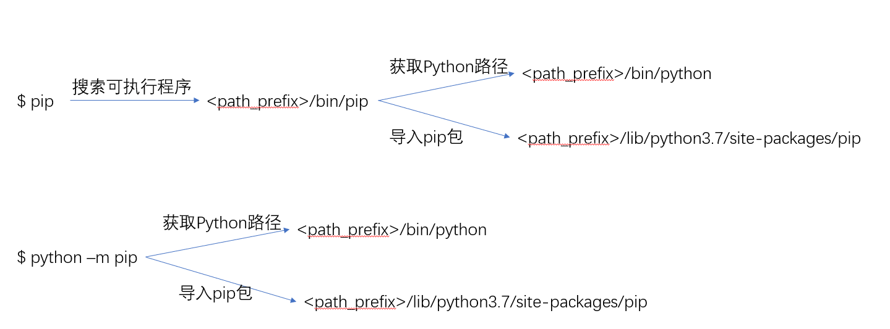

# 你的 Python 包都装到哪了

> 转载自 <https://frostming.com/2019/03-13/where-do-your-packages-go/>

## 前言

写这篇文章是因为最近在 Python 社区看到，有几个求助频率非常高的问题：

- 我安装了 pip 为什么运行报找不到可执行文件？

- import module 为什么报 `ModuleNotFound`？

- 为什么我用 Pycharm 能运行在 cmd 里运行不了？

授人以鱼不如授人以渔，要解决这类问题，你得知道 Python 是如何找包的。希望看完这篇文章，能有所帮助。（主要还是下次再有人问，我就可以链接甩脸了哈哈）

## Python 是如何寻找包的

现在大家的电脑上很可能不只有一个 Python，还有更多的虚拟环境，导致安装包的时候，一不小心你就忘记注意安装包的路径了。首先我们来解决找包的问题，这个问题回答起来很简单，但很多人不知道这个原理。假如你的 Python 解释器的路径是 `$path_prefix/bin/python`，那么你启动 Python 交互环境或者用这个解释器运行脚本时，会默认寻找以下位置[^1]：

[^1]: 本文示例均使用 Unix 路径习惯，如果是 Windows 系统则应当做适当改动，如 `$path_prefix/bin` 应为 `$path_prefix/Scripts`

1. `$path_prefix/lib`（标准库路径）
2. `$path_prefix/lib/pythonX.Y/site-packages`（三方库路径，X.Y 是对应 Python 的主次版本号，如 3.7, 2.6）
3. 当前工作目录（`pwd`命令的返回结果）

这里如果你用的是 Linux 上的默认 Python，`$path_prefix` 就是 `/usr`，如果你是自己使用默认选项编译的，`$path_prefix` 就是 `/usr/local`。从上面第二条可以看到不同 Python 版本的三方库路径不同，如果你把 Python 从 3.6 升级到 3.7 那么之前装的三方库都没法用了。当然你可以整个文件夹都拷贝过去，大部分情况不会出问题。

### 几个有用的函数

- `sys.executable`：当前使用的 Python 解释器路径
- `sys.path`：当前包的搜索路径列表
- `sys.prefix`：当前使用的 `$path_prefix`

**例：**

```python
>>> import sys
>>> sys.executable
'/home/frostming/.pyenv/versions/3.7.2/bin/python'
>>> sys.path
['', '/home/frostming/.pyenv/versions/3.7.2/lib/python37.zip', '/home/frostming/.pyenv/versions/3.7.2/lib/python3.7', '/home/frostming/.pyenv/versions/3.7.2/lib/python3.7/lib-dynload', '/home/frostming/.local/lib/python3.7/site-packages', '/mnt/d/Workspace/pipenv', '/home/frostming/.pyenv/versions/3.7.2/lib/python3.7/site-packages']
>>> sys.prefix
'/home/frostming/.pyenv/versions/3.7.2'
```

### 使用环境变量添加搜索路径

如果你的包的路径不存在上面列出的搜索路径列表里，可以把路径加到 `PYTHONPATH` 环境变量里，多个路径用 `:` 隔开（Windows 用 `;`）。

但需注意，避免把不同 Python 版本包的路径加到 `PYTHONPATH` 里，比如 `PYTHONPATH=/home/frostming/.local/lib/python2.7/site-packages`，因为 `PYTHONPATH` 中的路径是优先于默认搜索路径，如果用 Python 3 的话会有兼容性问题。事实上 `PYTHONPATH` 里最好不要出现任何带 `site-packages` 的路径。

顺便说下 `PATH` 是用来找**可执行程序**的搜索路径，假如你在终端中运行命令 `my_cmd`，系统会依次扫描 `PATH` 中的路径，看 `my_cmd` 是否存在于该路径下，所以如果提示找不到程序或命令无法识别，那你就要看路径是否加到 `PATH` 里了。

## Python 是如何安装包的

现在用安装 Python 包基本是用的 `pip`，就算你是用 `pipenv`，`poetry`，底层依然是 `pip`，一律适用。 如果你没有安装 `pip` 请参考[这里](https://pip.pypa.io/en/stable/installing/)，如果安装了还无法用 `pip` 命令请参考上一节。

运行 `pip` 有两种方式：

- `pip ...`
- `python -m pip ...`

第一种方式和第二种方式大同小异，区别是第一种方式使用的 Python 解释器是写在 `pip` 文件的 shebang 里的，一般情况下，如果你的 `pip` 路径是 `$path_prefix/bin/pip`，那么 Python 路径对应的就是 `$path_prefix/bin/python`。如果你用的是 Unix 系统则 `cat $(which pip)` 第一行就包含了 Python 解释器的路径。第二种方式则显式地指定了 Python 的位置。这条规则，对于所有 Python 的可执行程序都是适用的。流程如下图所示。

那么，不加任何自定义配置时，使用 `pip` 安装包就会自动安装到 `$path_prefix/lib/pythonX.Y/site-packages` 下（`$path_prefix` 是从上一段里得到的），可执行程序安装到 `$path_prefix/bin` 下，如果需要在命令行直接使用 `my_cmd` 运行，记得加到 `PATH`。

### pip 中更改安装位置的选项

- `--prefix PATH`，替换 `$path_prefix` 为给定的值
- `--root ROOT_PATH`，在 `$path_prefix` 前面加上 `ROOT_PATH`，比如 `--root /home/frostming`，`$path_prefix` 就会从 `/usr` 变成 `/home/frostming/usr`
- `--target TARGET`，直接指定安装位置到 `TARGET`

## 虚拟环境

虚拟环境就是为了隔离不同项目的依赖包，使他们安装到不同的路径下，以防止依赖冲突的问题。理解了 Python 是如何安装包的机制之后就不难理解虚拟环境（`virtualenv`, `venv`模块）的原理。其实，运行`virtualenv myenv`会复制一个新的 Python 解释器到`myenv/bin`下，并创建好`myenv/lib`，`myenv/lib/pythonX.Y/site-packages`等目录（`venv`模块不是用的复制，但结果基本一样）。执行`source myenv/bin/activate`以后会把`myenv/bin`塞到`PATH`前面，让这个复制出来的 Python 解释器最优先被搜索到。这样，后续安装包时，`$path_prefix`就会是`myenv`了，从而实现了安装路径的隔离。

## 脚本运行方式对搜索路径的影响

> 本节于 2021/1/21 新增

从上面的介绍大家可以知道，Python 找不找得到一个包，最直接的原因是 `sys.path`，而更进一步的原因是 `sys.executable` 的路径。程序写完了，我们总得需要运行它，不同的运行方法却有可能影响到 `sys.path` 而造成不同的行为，下面我们就来讨论这个问题。

假设你的包结构如下

```bash
.
├── main.py
└── my_package
    ├── __init__.py
    ├── a.py
    └── b.py
```

`main.py` 的内容：

```python
import my_package.b
```

`b.py` 的文件内容很简单：

```python
import sys
print("I'm b")
print(sys.path)
```

现在在 `main.py` 同级的目录下执行

```bash
$ python main.py
I'm b
['/home/frostming/test_path', ...]  # 省略的路径是共同的，与讨论的问题无关
$ python my_package/b.py
I'm b
['/home/frostming/test_path/my_package', ...]
```

`python xxx.py` 的运行方式叫做**直接运行**，这时该文件中的 `__name__` 值会指定为 `__main__`，IDE 中的「 Run File」「 运行脚本」用的就是这种方式。可以看到这时 `sys.path`的第一个值是**该脚本文件所在的目录**，随脚本路径而变化，记住我们执行测试始终是在 `/home/frostming/test_path` 这个目录下。

好，那么如果我们需要在 `b.py` 中导入 `a.py`，`a.py` 包含简单的一行 `print("I'm a")`，那么 `b.py` 脚本中应该怎么写呢？

1. Easy!, `import a`，好，再执行一遍上面的测试

```bash
$ python main.py
ModuleNotFoundError: No module named 'a'
$ python my_package/b.py
I'm a
I'm b
['/home/frostming/test_path/my_package', ...]
```

第一个测试出错了，如果前面的内容你已经看过，这个报错就是意料之中了——`sys.path` 压根没有 `a.py` 所在的目录 `/home/frostming/test_path/my_package`，当然找不到 `a` 了。

1. 改成 `from my_package import a`，测试就不做了，因为基于同样的分析，我们可以预测第一个运行没问题而第二个会报错找不到 `my_package`。注意由于 `b` 是在 `my_package` 包中的，这时可以使用**相对导入**，写 `from . import a` 和 `from my_package import a` 的效果是一样的。

那么我有没有让这两次运行都不报错的方法呢？有。我们要知道，一个项目中的入口是有限的，实际上不会出现可以执行的代码既在顶层有，又在子目录里也有。我们应该把主要的运行逻辑，都放在 `main.py` 中（不一定是这个名字，比如 Django 项目是 `manage.py`），如果这时确实需要运行一个子目录中某脚本的代码，应该用 `python -m <module_name>`，而 `b.py` 中导入 `a` 的语句应为 `from my_package import a`，我们来看一下运行效果：

```bash
$ python main.py  # 和 python -m main 效果一样
I'm a
I'm b
['/home/frostming/test_path', ...]
$ python -m my_package.b
I'm a
I'm b
['/home/frostming/test_path', ...]
```

可以看到这两次运行的 `sys.path` 内容一致了，它的第一个值是**当前运行所在的目录**。这种运行方式叫做**以模块方式运行**，`python -m` 后面的参数是（以 `.` 分隔的）**模块名**，而不是路径名。由于这种统一性，你在项目中的所有导入都可以用相同的定义方式，而不用管是在哪个脚本中。这也是为什么 Django 官方文档中推荐导入名称全部用 `myapp.models.users` 这种形式。

除此之外，以模块方式运行的时候，传入模块名的每一级父模块（或包）都会以模块形式运行，这意味着你可以在模块中使用相对导入（以直接运行方式运行不可以），并且传入的模块中`__name__` 的值会置为 `__main__`，你依然可以应用 `if __name__ == "__main__":` 的判断。如果 `python -m <module_name>` 中传入的模块是个包，那么会执行包目录中的 `__main__.py` 脚本（如果存在），此时该脚本的 `__name__` 值为 `__main__`。

## 总结

看到这里大家可以发现，关于包路径搜索最重要的就是这个`$path_prefix`路径前缀，而这个值又是从使用的 Python 解释器路径推导出来的。所以要找到包的路径，只需要知道解释器的路径就可以了，如果遇到改变包的路径，只需要通过正确的`PATH`设置，指定你想要的 Python 解释器即可。

现在回到开头的三个问题，大家会解决了吗？在评论区写出你的排查步骤或解决方法。
